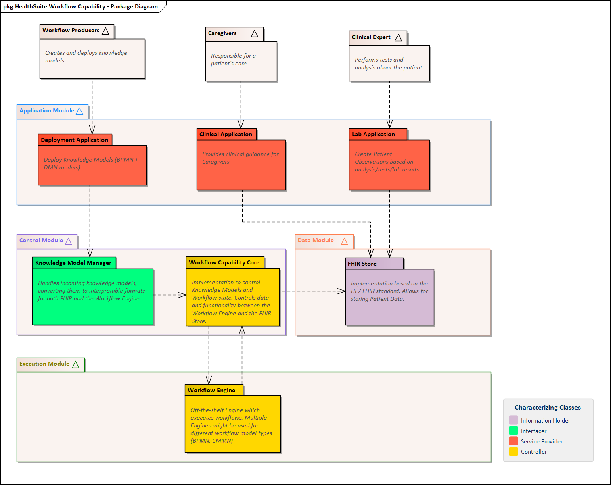
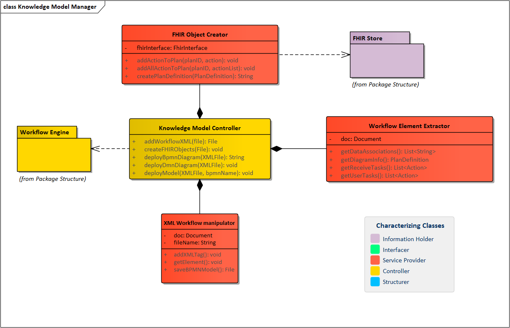
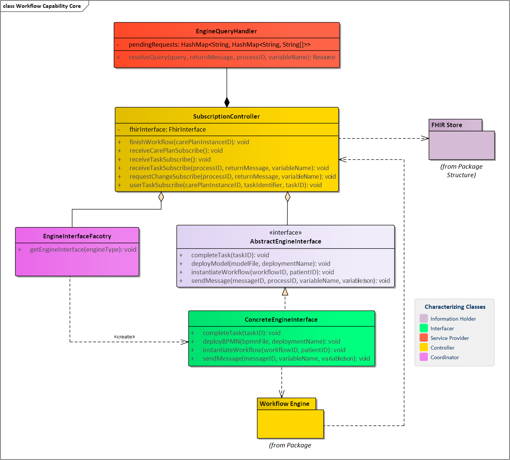

This page will describe the overall architecture of the system, more detailed information about the architecture is found in [van der Heijden, J. J. M. J. (Accepted/In press). Standardized software solution for guidance of clinical workflows. Technische Universiteit Eindhoven.](https://research.tue.nl/en/publications/standardized-software-solution-for-guidance-of-clinical-workflows) Take note that this is the initial architecture delivered after the project completed, changes made after completion of the project aren't accounted for in documentation below.

# FHIR Mapping
The system uses a mapping to convert elements from the Knowledge Model (BPMN,  DMN) to the FHIR Standard. In the FHIR Mapping the following data is considered:
* General information about the workflow definition, e.g. the workflow name and description
* Information about the instance of a workflow, e.g. which patient is the workflow instantiated for
* Information about tasks, needed by the user of the system
* Information about the status of a task

A distinction has been made between a definition of a workflow and an instance.
A definition is mapped upon **deploying** a workflow, and an instance is made upon **starting** a workflow.

This means the following elements have been mapped from the BPMN XML standard to the FHIR Standard:

| BPMN   XML Tag | BPMN Attribute | FHIR Definition                 | FHIR Instance                              |
|----------------|----------------|---------------------------------|--------------------------------------------|
| bpmn:process   |                | PlanDefinition                  | CarePlan                                   |
|                | id             | PlanDefinition.identifier.value | CarePlan.identifier.value                  |
|                | name           | PlanDefinition.name             | CarePlan.name                              |
|                |                |                                 | CarePlan.status = "draft"                  |
|                |                |                                 | CarePlan.category = " Workflowcapability"  |
|                |                |                                 | CarePlan.intent = "plan"                   |
|                |                |                                 | CarePlan.subject.reference = Patient Ref   |

| BPMN XML Tag  | BPMN Attribute | FHIR Definition            | FHIR Instance           |
|---------------|----------------|----------------------------|-------------------------|
| bpmn:userTask |                | PlanDefinition.action      | Task                    |
|               | id             | PlanDefinition.action.id   | Task.identifier.value   |
|               | name           | PlanDefinition.action.name |                         |
|               |                |                            | Task.status = "ready"   |
|               |                |                            | Task.intent = "unknown" |

# UML Diagrams
The logical view of the system describes the end-user and functionality of the system. This is presented in UML Package and class diagrams.

The following figure gives an overview of the system:

To go into more detail on some complex packages, here follows the Knowledge Model Manager class diagram:

And the WFC Core:

# UML to Code Mapping
To show how the static organization of the code maps to the diagrams mentioned above, in this section we will describe the static code file from the file structure to the class from the class diagram.

**(Knowledge Model Manager)**
| Class from Class Diagram   | File from File structure  |
|----------------------------|----------------------------------------------------|
| Knowledge Model Controller | KnowledgeModelController.java                      |
| FHIR Object Creator        | FHIRObjectCreator.java                             |
| Workflow Element Extractor | BPMNElementExtractor.java                          |
| XML Workflow Manipulator   | camundaInterface/CamundaXMLModifier.java           |

**(Workflow Capability Core)**
| Class from Class Diagram   | File from File structure  |
|----------------------------|----------------------------------------------------|
| SubscriptionController     | SubscriptionController.java                        |
| EngineQueryHandler         | EngineQueryHandler.java                            |
| AbstractEngineInterface    | EngineInterface.java                               |
| EngineInterfaceFactory     | EngineInterfaceFactory.java                        |
| ConcreteEngineInterface    | CamundaInterface.java                              |

