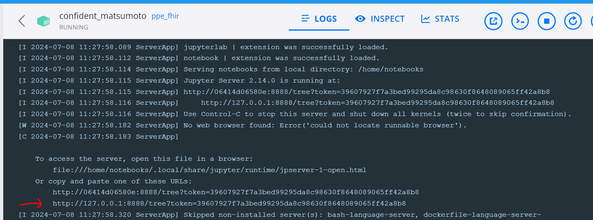
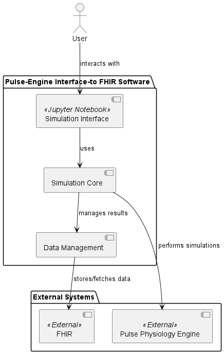
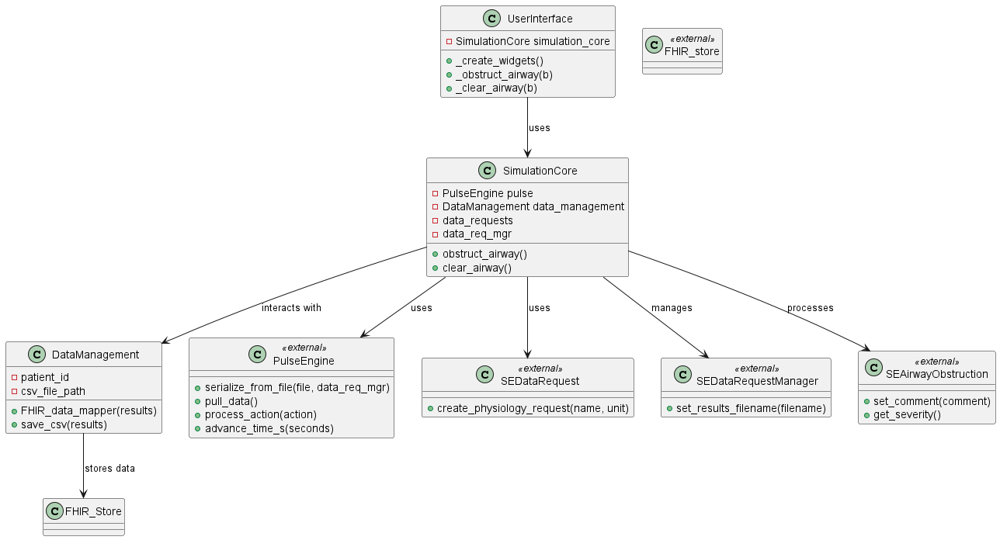

# Pulse Engine -FHIR Interface App

## Overview

The Pulse Engine -FHIR Interface App is a Jupyter Notebook application that leverages the Pulse Physiology Engine to simulate physiological scenarios. The system integrates with a Fast Healthcare Interoperability Resources (FHIR) server to manage the observations recorded during simulations.

### Note:
#### There are two versions of this demo due to issues with the Pulse Physiology Engine data result fetching. The updated version accesses data from a CSV file instead of direct result.
- The Issue was reported to the kitware in the following linls: https://gitlab.kitware.com/physiology/jupyter/-/issues/3

## Prerequisites

Before you begin, ensure you have the following installed:
- Docker
- Git (optional, for cloning repository)

## Getting Started

### Clone the Repository (Optional)

Instruction to clone the repository using:

```sh
git clone <repository-url>
cd <repository-folder>

Note: This repository is based on version:  kitware/pulse:4.1.0

Build the Docker Image
To build the Docker image for the project, navigate to the directory containing the Dockerfile and run:

docker build -t ppe_fhir .
Run the Docker Container
To run the Docker container with Jupyter Notebook:

docker run -p 8888:8888 ppe_fhir jupyter notebook --ip="0.0.0.0"
This command maps port 8888 on your local machine to port 8888 on the container and starts the Jupyter Notebook server.

Access the Jupyter Notebook
After running the container, open a web browser and navigate to:

http://127.0.0.1:8888/notebook
Enter the token provided in the terminal to log in to the Jupyter Notebook interface.



Application Usage
FHIR Server Configuration
The FHIR server is configured with the following URL:


FHIR_SERVER_URL = "http://host.docker.internal:8180/fhir"
Use http://host.docker.internal:8180/fhir instead of http://localhost:8180/fhir or http://127.0.0.1:8180/fhir
```
- But why http://host.docker.internal:8180/fhir ?
#### Problem: Network Boundaries
- Container Isolation: The FHIR server inside the Docker container has its own network environment. localhost or 127.0.0.1 for the notebook application refers to your host machine, not the container.

- Accessing the Container: Your notebook application, running on your host machine, needs a way to reach inside the Docker container's network to communicate with the FHIR server.

##### Solution: host.docker.internal to the Rescue

- The Bridge: host.docker.internal is a special hostname specifically for this purpose. Docker provides it as a way to address your host machine from within containers.

- How it Works: Docker dynamically maps host.docker.internal to the correct IP address of your host machine, essentially allowing your notebook app to talk to the FHIR server as if they were on the same network.

#### Why it Matters
- Using the correct URL ensures your notebook application can successfully:
 - Send requests to the FHIR server within the container
 - Retrieve FHIR data needed for its functionality

- This URL is specially designed to allow communication from within a Docker container to the host machine.

#### Simulating Scenarios
- Run the application notebook within the Jupyter interface.
- Enter the patient_id when prompted by the notebook.
- Use the interactive buttons provided to simulate different physiological scenarios such as airway obstruction and clearing.
- The simulation results will be logged and sent to the FHIR server in real-time.
#### Troubleshooting
- If you encounter any issues:
    - Ensure Docker is running on your system.
    - Verify that the FHIR server is up and accessible at the specified URL.
    - Check the Docker container logs for any error messages or indications of problems.

- After running the code and entering the real patient Id, expect the initial state values registered in the FHIR server. After hitting the button Obstruct air for 20 seconds, the Fhir server will get the last available values and same is for any actions taken.

- Look at the UML use case diagram 
- The diagram shows clearly how a user interacts with the system and how different internal and external components are connected and interact with each other.
- Additionaly, the following class diagram provides a high-level overview of the components and their interactions in the system, highlighting how the user interface interacts with the simulation core, which in turn interacts with data management and external components.

#### To run closed loop scenario, use the following models.
 -  workflow_models
        \..Sepsis
            \---v3
                    \---BPMN
                        \---CLOSED-LOOP
                                closed-loop-interrupting.bpmn
                                closed-loop-non-interrupting.bpmn
                    \--DMN
                        respiratory-check.dmn